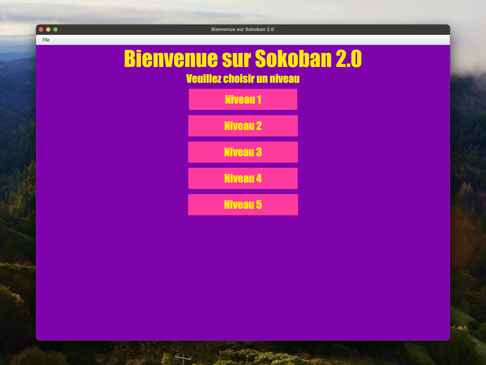
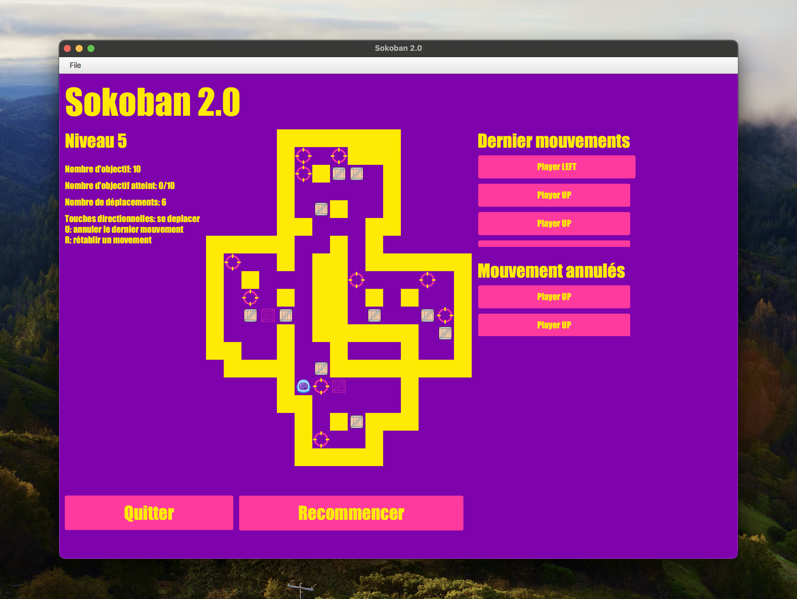

# Sokoban
<!-- ❌ Don't Delete This Comment ❌
Project short description:
  Full-stack clone of the famous puzzle game Sokoban
Project Topics (tags):
  java cli maven javafx
-->

This application is a clone of the famous puzzle game Sokoban. It respects the MVC architecture, the Observer pattern and the SOLID principles.

## Features

* Choose the level
* Implement the *Undo* and *Redo* commands
* Colorful GUI
* Use the keyboard arrow to move
* Show the list of movements done and undone

See all features in action on Youtube: <https://www.youtube.com/watch?v=IfcvmUeEVh4>

## Technologies

* Java
* JavaFX
* Maven

<!--
## Documentation
### Class Diagram
-->

## Screenshots

### Home

### Level

